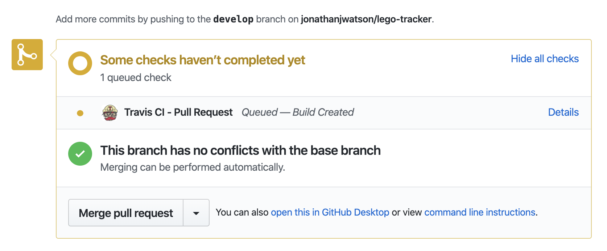

# lego-tracker


## Setup

1. Create a repository on GitHub
2. Include Readme
3. Check gitignore for node modules
4. Check Travis CI integration

## Basic Server Up and Running

1. ```touch server.js```
2. ```npm init -y```
3. ```npm install express sequelize mysql2```
4. Copy/paste server.js boilerplate
5. Test the server by running ```npm run start```

## Integrate Sequelize
1. Run the following command: ```sequelize init:config & sequelize init:models``` (You should see a config folder and a models folder);
2. Modify the config.json development object with your database and credentials.
3. Create matching database using MySQL Workbench.
4. Save the create script to db/schema.sql
5. Enable sequelize portions of server.js
6. Test the server with sequelize by running ```npm run start```

## Integrate Handlebars
** NOTE: As of January 2020, there was a conflict in handlebars and express-handlebars. The following configuration is necessary to avoid this settings conflict. **
1. ```npm install express-handlebars@3.1.0```
2. ```npm install handlebars@4.5.3```
3. Uncomment handlebars portion of server.js
```js
app.get("/", function (req, res) {
  res.render("index");
});
```
4. Create the folder structure for handlebars
    a. views folder
    b. views/index.handlebars
    c. views/layouts folder
    d. views/layouts/main.handlebars
5. Add html boilerplate to main.handlebars
6. Add ```{{{ body }}}``` to main.handlebars
7. Test by running ```npm run start```

### Housekeeping
1. Create a dev script so I can run ```npm run dev```: in package.json
2. Add my .eslintrc.json and .eslintignore files
3. Run ```npm install eslint@4.19.1```
4. Create a script to run eslint: ```npm run lint``` in package.json, should execute the following: ```eslint **/*.js --quiet```
5. Modify our test script to run the linter ```npm run lint```
6. Test this by running ```npm run lint```
7. Incorporate Travis CI by writing your .travis.yml file
8. Update your /config/config.json with the .travis.yml test database name.
9. Secure the master branch and test Travis CI Integration
    a. Navigate to Settings -> Branches
    b. Under Branch Protection Rules, select "Add rule"
    c. Branch name pattern: master
    d. Select the following items
    
       - [ ] Require pull request reviews before merging
       - [ ] Require status checks to pass before merging
       - [ ] Require branches to be up to date before merging
       - [ ] Travis CI - Branch
    e. Test Travis CI by creating a new branch and opening a Pull Request

    
## To Deploy to Heroku
Modify your config/config.json file as follows: 

```json
"production": {
    "use_env_variable": "JAWSDB_URL",
    "dialect": "mysql"
  }
  ```